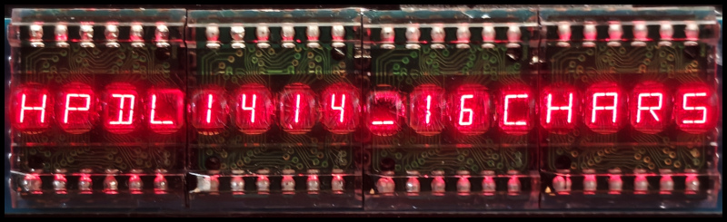
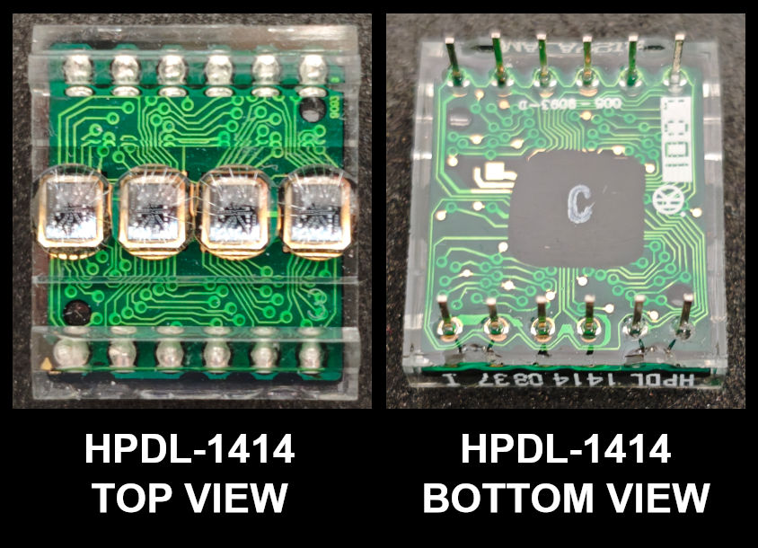
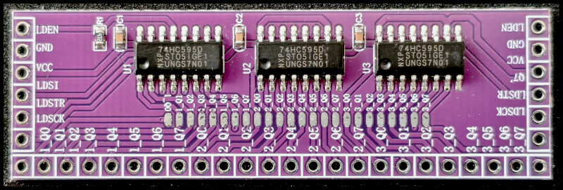

> [!IMPORTANT]
> Be carefull when soldering HPDL-1414 modules. Keep the temperature as low as possible when soldering and minimize soldering time.
> The modules will be damaged if the temperature during soldering gets too high.


# HPDL-1414 16-Digit Driver (ESP32-S3 + 2× 74HC595 Output Modules)

Most of this project's code and documentation were generated by ChatGPT. [Rdagger's HPDL-1414 driver](https://github.com/rdagger/micropython-hpdl1414) (released under MIT license) was used as part of the input promt for ChatGPT.

The HPDL-1414 displays and the 3x74HC595 output expander were purchased from AliExpress for approx. 2.5 € and 1.8 €, respectively.

---


This project drives **four HPDL-1414** (4-character “smart” alphanumeric) displays as a single **16-character display** using an **ESP32-S3** running **MicroPython**.






The outputs are provided by **two identical 74HC595 output expander modules**, each containing **three 74HC595** shift registers daisy-chained on one PCB:

- **Module A:** 3×74HC595 → 24 outputs  
- **Module B:** 3×74HC595 → 24 outputs  
- **Total:** 6×74HC595 → 48 outputs

The driver supports:
- `show_text()` (sync)
- `show_text_async()` (uasyncio)
- `scroll_text_async()` for long messages


---

## How the 74HC595 modules work

A **74HC595** is an 8-bit **serial-in / parallel-out** shift register with an output latch. In simple terms:

1. You send bits **serially** into `SER` (module pin `LDSI`) using the shift clock `SRCLK` (module pin `LDSCK`).
2. Internally, the chip shifts those bits through an 8-bit shift register.
3. When you toggle the latch clock `RCLK` (module pin `LDSTR`), the current 8-bit value is copied into an output register, updating the output pins `Q0..Q7` simultaneously.
4. The pin `Q7'` outputs the serial stream, allowing **daisy chaining**: connect `Q7'` of one 74HC595 to `SER` of the next.

Because the latch clock updates outputs only after all bits are shifted in, you can update many outputs cleanly without intermediate glitches.

### Daisy chaining across modules

In this build there are 6×74HC595 total (48 outputs). They behave like one long 48-bit shift register:

- All chips share the same clocks: `LDSCK` (shift) and `LDSTR` (latch).
- Data flows through the chain via `Q7' -> LDSI`.

So the ESP32 shifts **48 bits** in one SPI write, then latches them once. The outputs become available as `OUT0..OUT47` in the software mapping.

---

## Hardware

- ESP32-S3 (MicroPython)
- 2× 74HC595 output expander module (each module has 3×74HC595)
- 4× HPDL-1414
- Power:
  - **3.3V** for ESP32-S3 and both 74HC595 modules
  - **5V** for the HPDL-1414 displays
  - **Common GND** across everything


> [!IMPORTANT]
> Note: HPDL-1414 needs a 5V power supply. The data pins are 3.3V compatible.
> Ground must be shared between the 3.3V domain and 5V domain.


---

## Module Pin Names

The 74HC595 modules used here expose these header pins:

**Control / power pins:**
- `VCC` (module supply, 3.3V)
- `GND`
- `LDSI`  — serial data in (equivalent to SER/DS)
- `LDSCK` — shift clock (equivalent to SHCP/SRCLK)
- `LDSTR` — latch/store clock (equivalent to STCP/RCLK)
- `LDEN`  — output enable (equivalent to OE\ on 74HC595, active-low)
- `Q7'`   — serial data out (equivalent to QH’/Q7’)

**Output pins:**
- 24 output pads/pins (3×8). The software treats them as `OUT0..OUT23` on Module A and `OUT24..OUT47` on Module B.

---

## Wiring

### 1) ESP32-S3 → Module A (first 3×74HC595 module)

Use SPI1 pins as configured in the code:

| ESP32-S3 GPIO | Connect to Module A |
|---:|---|
| GPIO12 (MOSI) | `LDSI` |
| GPIO10 (SCK)  | `LDSCK` |
| GPIO11 (LATCH)| `LDSTR` |
| GPIO9 (optional) | `LDEN` *(see note below)* |
| 3.3V | `VCC` |
| GND | `GND` |

**LDEN / Output enable note**
- `LDEN` is **active-low** (OE\).
- If you want outputs always enabled, you can tie `LDEN` to **GND**.
- If you want software control, wire `LDEN` to **GPIO9** and keep it low to enable outputs.

The example code sets `PIN_EN = 9` and drives it low.

---

### 2) Module A → Module B (second 3×74HC595 module)

This is the critical part: **daisy-chain serial data**, and **share clocks / enable**.

Connect:

| From Module A | To Module B |
|---|---|
| `Q7'` | `LDSI` |
| `LDSCK` | `LDSCK` |
| `LDSTR` | `LDSTR` |
| `LDEN` | `LDEN` *(if used)* |
| `VCC` | `VCC` (3.3V) |
| `GND` | `GND` |

Explanation:
- `Q7'` carries the shifted serial stream out of Module A’s last 74HC595.
- Module B receives that stream on `LDSI`.
- Both modules must see the same `LDSCK` and `LDSTR` edges so the full 48-bit chain clocks and latches as one unit.
- `LDEN` should be the same for both modules (either tied low or driven by GPIO).

---

### 3) 74HC595 outputs → HPDL-1414 signals

Each HPDL-1414 needs exactly **10 lines**:
- `A0`, `A1`
- `D0..D6` (7 data lines)
- `WR` (write strobe, **idle HIGH**, short **LOW pulse** writes data)

The driver maps each display to a “block” of 10 outputs:

**Per display block (base offset):**
- `A0` = `OUT(base + 0)`
- `A1` = `OUT(base + 1)`
- `D0` = `OUT(base + 2)`
- ...
- `D6` = `OUT(base + 8)`
- `WR` = `OUT(base + 9)`

#### Base offsets used by the code

```python
display_base_bits = [0, 10, 24, 34]
```

Which means:

**Display 1 (base 0):**
- A0=OUT0, A1=OUT1, D0..D6=OUT2..OUT8, WR=OUT9

**Display 2 (base 10):**
- A0=OUT10, A1=OUT11, D0..D6=OUT12..OUT18, WR=OUT19

**OUT20..OUT23:** unused

**Display 3 (base 24):**
- A0=OUT24, A1=OUT25, D0..D6=OUT26..OUT32, WR=OUT33

**Display 4 (base 34):**
- A0=OUT34, A1=OUT35, D0..D6=OUT36..OUT42, WR=OUT43

**OUT44..OUT47:** unused

---

### 4) HPDL-1414 power

For each HPDL-1414:
- `VDD` → **+5V**
- `GND` → **GND** (same common ground as ESP32 and modules)

---

## Software

### Requirements
- MicroPython on ESP32-S3
- `asyncio`

Tested with MicroPython v1.27.0 on 2025-12-09; Generic ESP32S3 module with ESP32S3.


### Key configuration in code
The example code config uses:

- `SCK = GPIO10`
- `MOSI = GPIO12`
- `LATCH = GPIO11`
- optional `LDEN = GPIO9` (active-low)

### Usage

#### Show text (sync)
```python
disp16.show_text("HELLO_WORLD_1234")
```

#### Show text (async)
```python
await disp16.show_text_async("ASYNC_UPDATE")
```

#### Scroll long text
```python
await disp16.scroll_text_async(
    "THIS MESSAGE IS LONGER THAN 16 CHARACTERS",
    delay_ms=120,
    loops=2
)
```

Parameters:
- `delay_ms`: scroll speed
- `gap`: spaces before/after message (default: 16)
- `loops`: number of passes (`0` = infinite)

---

## Resources

- [Datasheet from Digikey](https://media.digikey.com/pdf/Data%20Sheets/Avago%20PDFs/HPDL-1414.pdf)
- [Rdagger's HPDL-1414 driver](https://github.com/rdagger/micropython-hpdl1414)

## License

MIT License.
